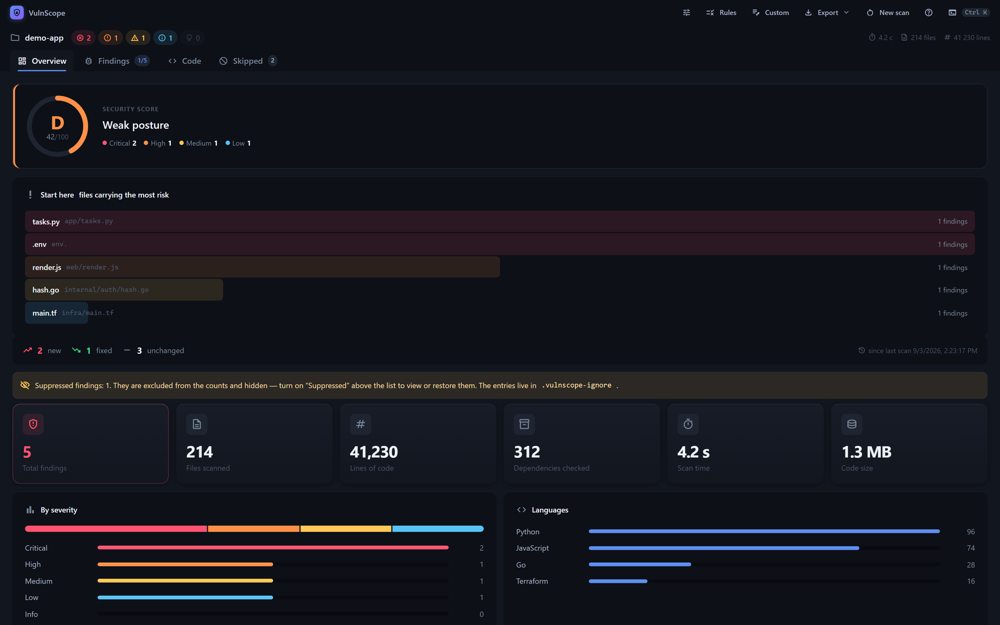
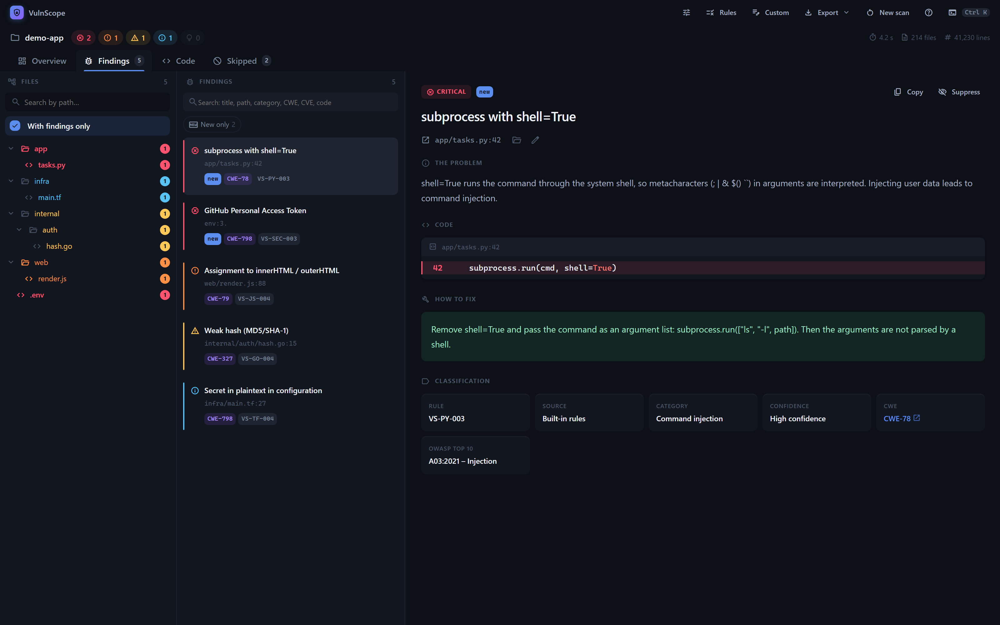

<div align="center">

# VulnScope

**Десктопный сканер безопасности, который работает целиком на вашей машине.**

274 правила статического анализа, детерминированный движок анализа потока данных,
55 детекторов секретов и проверка CVE — для локальных проектов и публичных
репозиториев.

[](https://github.com/mintyextremum/vulnscope/actions/workflows/checks.yml)
[](https://github.com/mintyextremum/vulnscope/releases/latest)
[](LICENSE)
[](https://github.com/mintyextremum/vulnscope/releases/latest)

*[English version](README.md)*



</div>

---

## Что это

Укажите VulnScope на папку или на ссылку GitHub — и получите размеченный отчёт:
опасные конструкции в коде, секреты в исходниках и известные CVE в зависимостях.
У каждой находки есть CWE, категория OWASP Top 10, уровень достоверности и
конкретная рекомендация.

**Анализ выполняется на вашем компьютере.** Наружу уходит единственный запрос — в
[OSV.dev](https://osv.dev) со списком имён и версий пакетов (не код), и то лишь
при включённой проверке CVE. Офлайн-режим убирает и это. Телеметрия и проверка
найденных секретов на стороне провайдера принудительно выключены и включиться не
могут.

## Установка

Скачайте установщик со **[страницы релизов](https://github.com/mintyextremum/vulnscope/releases/latest)**:

| Файл | Что это |
|---|---|
| `VulnScope_1.0.0_x64-setup.exe` | Установщик NSIS — обычный выбор |
| `VulnScope_1.0.0_x64_en-US.msi` | MSI-пакет, для развёртывания через групповые политики |

Windows 10 или 11, 64 бита. Больше ничего ставить не нужно: WebView2 входит в
Windows 11 и в актуальные сборки Windows 10, своего рантайма VulnScope не тащит.

При первом запуске Windows покажет предупреждение SmartScreen: сборки не подписаны
сертификатом — он стоит дороже, чем этот проект приносит. Нажмите **Подробнее →
Выполнить в любом случае** или соберите приложение из исходников (см.
[Разработку](#разработка)).

> **Сборка из исходников — второй поддерживаемый путь.** Релизов для macOS и Linux
> сегодня нет: код собирается кроссплатформенно, но проверялся только на Windows,
> а публиковать непротестированные бинарники нечестно.

## Содержание

- [Что оно находит](#что-оно-находит)
  - [Правила](#код--274-встроенных-правила) · [Анализ потока данных](#анализ-потока-данных-флагман) · [Индикаторы компрометации](#индикаторы-компрометации) · [Секреты](#секреты--55-правил) · [Зависимости](#зависимости--cve-через-osvdev) · [Внешние сканеры](#внешние-сканеры-необязательно)
- [Что оно не анализирует](#что-оно-не-анализирует)
- [Работа с результатами](#работа-с-результатами)
  - [Оценка защищённости](#оценка-защищённости) · [Пока идёт скан](#пока-идёт-скан) · [Сравнение сканов](#сравнение-с-прошлым-сканом) · [Подавление](#подавление-находок) · [Подотчётность](#подотчётность)
- [Экспорт](#экспорт)
- [Интерфейс](#интерфейс) · [Доступность](#доступность) · [Язык](#язык) · [Темы](#темы) · [Настройки](#настройки)
- [Разработка](#разработка) · [Как это устроено](#как-это-устроено) · [Точность и границы](#точность-и-границы)
- [Участие в проекте](#участие-в-проекте) · [Безопасность](#безопасность) · [Лицензия](#лицензия)

---

## Что оно находит

### Код — 274 встроенных правила

Для 37 языков. Инъекции команд, SQL, NoSQL, LDAP, XPath, JNDI и шаблонов (SSTI,
SpEL), XSS, загрязнение прототипа, небезопасная рефлексия (`Class.forName`,
`constantize`), path traversal, открытые редиректы, небезопасная десериализация
(`pickle`, `yaml.load`, SnakeYAML, `XMLDecoder`, XStream, Jackson default typing,
Json.NET `TypeNameHandling`, `binary_to_term`), XXE, выполнение кода через
ScriptEngine/Groovy, отключённая проверка TLS и ключей SSH, слабая криптография
(ECB, зашитый ключ, нулевой IV), сравнение секретов не за постоянное время, mass
assignment, Zip Slip, обход проверки JWT, зашитый `SECRET_KEY`, `xp_cmdshell` и
файловые операции в SQL, проблемы `unsafe` в Rust, ошибки конфигурации в
Dockerfile, GitHub Actions, Terraform, nginx и Kubernetes (привилегии, хостовые
пространства имён, опасные capabilities).

| Язык | Правил |  | Язык | Правил |
|---|---|---|---|---|
| Python | 39 | | Nginx | 5 |
| JavaScript / TypeScript / React | 36 | | SQL | 4 |
| Java / Kotlin | 30 | | Shell | 4 |
| Terraform | 28 | | PowerShell | 4 |
| PHP | 17 | | Elixir | 4 |
| Ruby | 14 | | Scala | 3 |
| C# | 14 | | Perl | 3 |
| Go | 13 | | Ansible | 3 |
| Kubernetes | 11 | | Lua | 2 |
| Rust | 10 | | Vue | 1 |
| Dockerfile | 10 | | Svelte | 1 |
| Swift · GitHub Actions · C/C++ | по 6 | | | |

Языки определяются по расширению и имени файла — Vue, Svelte, GraphQL, SQL и
другие распознаются и попадают в статистику, даже если специальных правил для них
пока нет. Полный список с описаниями и рекомендациями открывается в приложении по
кнопке «Правила» (`Ctrl+R`).

**Свои правила.** Кнопка «Свои» (`Ctrl+E`) открывает редактор: регулярное
выражение, важность, языки, CWE/OWASP и рекомендация. Есть живой предпросмотр —
правило проверяется на вашем примере кода до сохранения, с показом того, какие
строки отсеклись через «не срабатывать, если содержит». Свои правила работают
наравне со встроенными: так же пропускают комментарии и тестовые файлы. Хранятся в
`%APPDATA%/vulnscope/rules.json`, есть импорт и экспорт набора.

### Анализ потока данных (флагман)

Собственный детерминированный движок, который не просто ищет опасный вызов на
строке, а отвечает на главный вопрос: **доходят ли до него пользовательские
данные?**

Он прослеживает ввод (запрос, `argv`, `stdin`) через присваивания переменных до
опасного приёмника — команд ОС, SQL, файловых операций, исходящих запросов,
`eval` — и показывает **весь путь «источник → переменная → приёмник»**, где каждый
шаг открывается в коде. Трассировка межпроцедурная внутри файла и сквозная между
файлами.

Если по пути стоит экранирование, параметризация или белый список, поток считается
разорванным и находка не выдаётся. Это ловит многострочные уязвимости, которых не
видят построчные правила, и каждая находка самопроверяема — виден точный маршрут.
Без ИИ и «чёрных ящиков»: одинаковый вход всегда даёт одинаковый ответ.

<div align="center">

</div>

### Индикаторы компрометации

Отдельная категория ловит не «рискованные приёмы», а то, что оставляет атакующий:
PHP-веб-шеллы (`eval($_POST[...])`, вызов функции по имени из запроса, упакованные
`eval(base64_decode(...))`), реверс-шеллы (`/dev/tcp/…`, netcat/mkfifo,
`pty.spawn` на сокет), download-cradle PowerShell (`IEX (…).DownloadString`) и
упакованные пейлоады (`eval(atob(…))`, `exec(base64.b64decode(…))`).

Всё это помечается как **критическое** с высокой достоверностью: обычный код так
не делает, а живой веб-шелл в дереве означает, что машина уже под контролем.

### Секреты — 55 правил

Ключи AWS и Azure Storage, токены GitHub, GitLab (включая runner и
pipeline-trigger), Slack (включая incoming webhook), npm, PyPI, Discord, Twilio,
Mailgun, Square, Hugging Face, Postman, Databricks, New Relic, Notion, Atlassian,
Linear, Doppler, PlanetScale, HashiCorp Vault, Grafana, Dropbox, Terraform Cloud,
Firebase, Adobe, Asana, Mailchimp, SonarQube, Figma, Airtable, Docker Hub,
RubyGems, Pulumi, ключи Stripe (в т.ч. секрет вебхука), Google, SendGrid, токены
Shopify и DigitalOcean, Sentry DSN, приватные ключи, строки подключения к БД, JWT.

Значения проверяются на энтропию, поэтому `your-api-key-here` и подобные
плейсхолдеры не попадают в отчёт. **Секрет маскируется везде** — и в интерфейсе, и
в любом экспорте, — так что сырое значение никогда не покидает файл. Это
проверяется тестом, который проходит по настоящему конвейеру.

### Зависимости — CVE через OSV.dev

Разбираются `package.json`, `package-lock.json`, `requirements.txt`,
`pyproject.toml`, `Cargo.toml`, `Cargo.lock`. Lock-файл имеет приоритет над
манифестом: в нём точные версии. Severity считается из CVSS-вектора, ответы
кэшируются на 7 дней — повторный скан того же проекта работает без сети.

**Дедупликация.** OSV агрегирует несколько баз (GHSA, PYSEC, RUSTSEC), поэтому
одна уязвимость приходит несколькими записями с одним CVE; с cargo-audit они
пересекаются ещё раз. Записи про один и тот же пакет-версию, у которых совпадает
хотя бы один идентификатор, схлопываются в одну — с объединённым набором CVE/CWE и
худшей из severity. На тестовом проекте это убирает ~40% дублей.

### Внешние сканеры (необязательно)

Если они есть в системе, их находки подхватываются и приводятся к общему формату.
Приложение полностью работоспособно и без них, но с ними покрытие заметно шире —
на тестовом проекте находок становится 197 вместо 155.

| Тул | Что добавляет | Установка |
|---|---|---|
| Semgrep | Тысячи правил с анализом потока данных для 30+ языков | `pipx install semgrep` |
| Bandit | Углублённый анализ Python по AST | `pipx install bandit` |
| Ruff | Быстрый линтер Python, правила безопасности из bandit | `pipx install ruff` |
| cargo-audit | Advisory базы RustSec для крейтов | `cargo install cargo-audit --locked` |
| Gitleaks | 150+ паттернов секретов | `scoop install gitleaks` |
| TruffleHog | 800+ детекторов, проверяет, живой ли ключ | `scoop install trufflehog` |
| osv-scanner | Официальный сканер OSV: больше экосистем | `scoop install osv-scanner` |
| Trivy | Уязвимости в зависимостях и IaC, плюс misconfig | `scoop install trivy` |
| Checkov | Тысячи проверок Terraform, CloudFormation, Kubernetes и Helm | `pipx install checkov` |
| gosec | Углублённый анализ безопасности Go по AST | `go install github.com/securego/gosec/v2/cmd/gosec@latest` |
| Grype | Уязвимости зависимостей из lock-файлов и SBOM | `scoop install grype` |
| Hadolint | Линтер Dockerfile по синтаксису, а не по шаблону | `scoop install hadolint` |
| npm audit | Аудит npm-зависимостей | входит в Node.js |

Когда несколько тулов (и встроенные правила) помечают **одну и ту же строку с тем
же CWE**, находки схлопываются в одну с перечислением всех согласившихся движков —
так одна инъекция команд не показывается трижды.

Карточка «Внешние сканеры» показывает точную команду и даёт её скопировать, но
**не скачивает и не запускает ничего сама**: сканер безопасности, который тянет и
исполняет бинарники, становится той самой угрозой цепочки поставок, которую он
призван искать. После установки достаточно нажать «Проверить снова».

> **govulncheck** можно установить из приложения, но его вывод пока не
> разбирается. Он честно помечен «не подключён», в счётчик не входит и в скан не
> попадает.

## Что оно не анализирует

Бинарники (`.exe`, `.dll`, `.so`, `.pyc`), медиа, архивы, минифицированные бандлы
и файлы больше 2 МБ. Бинарные файлы определяются не только по расширению, но и по
содержимому — NUL-байты в первых 8 КБ выдают файл, как бы он ни назывался.

Всё пропущенное перечислено на вкладке «Пропущено» с причиной: чистый отчёт должен
быть честным, а не чистым за счёт того, что молча проигнорировали.

`node_modules`, `venv`, `target` и подобные каталоги пропускаются по умолчанию —
чужой код вы всё равно чинить не будете. Галочка «Включая зависимости» это
отключает.

## Работа с результатами

### Оценка защищённости

Одно число на весь отчёт — шкала 0–100 с буквенной оценкой. Каждая находка
вычитает баллы с весом по важности и — это и отличает оценку — по тому, доказал ли
движок потока данных её **достижимость** из недоверенного ввода. Достижимая
критическая опаснее изолированной, и оценка это учитывает.

Она детерминированная и полностью объяснимая: один и тот же отчёт всегда даёт один
и тот же балл, и каждый балл прослеживается до фактора в разбивке. На дашборде
рядом — **пути атаки**, отсортированные по опасности; клик открывает находку.

### Пока идёт скан

Экран сканирования показывает конвейер этапов: что уже позади, что идёт сейчас,
что впереди. Список строится из настроек конкретного прогона — этап, которого не
будет, не висит в ожидании. Это не украшение: анализ кода занимает миллисекунды, а
запрос к OSV — секунды, и без конвейера пауза выглядит зависанием.

Процент показывается только там, где он что-то значит — пока читаются файлы. На
запросе к OSV и на внешних сканерах вместо него крутится дуга с названием этапа:
все файлы уже прочитаны, и «100%» означало бы «готово» там, где работа идёт ещё
минуту.

«Отменить» действительно останавливает работу: запущенный сканер убивается, а не
дорабатывает до конца. Прерванный прогон всегда помечается как отменённый, даже
если успел собрать находки: отчёт, который выглядит полным, — худшее, что может
сделать сканер безопасности.

### Сравнение с прошлым сканом

Каждый скан цели сохраняет снимок находок, и следующий показывает разницу: сколько
появилось нового, сколько исчезло, сколько осталось. На большом проекте важно не
общее число, а то, что вы добавили за сегодня.

Находка опознаётся по отпечатку: хеш от идентификатора правила, пути и самого кода
со схлопнутыми пробелами — **без номера строки**. Добавленный сверху импорт
сдвигает весь файл; если считать по строкам, каждая находка окажется «исправлена»
и тут же «появилась заново», а все подавления молча слетят. Переформатирование по
той же причине отпечаток не ломает.

Первый скан цели честно говорит, что сравнивать не с чем, вместо «0 новых». Снимки
лежат в `%APPDATA%/vulnscope/history/`, по одному на проект.

### Подавление находок

Ложное срабатывание или осознанно принятый риск скрывается кнопкой «Подавить».
**Причина обязательна**: подавление без объяснения ничем не отличается от попытки
спрятать проблему, и через полгода никто не вспомнит, почему здесь тихо.

Записи лежат в `.vulnscope-ignore` **в самом проекте**, а не в настройках
приложения: это решение об этом коде, поэтому оно версионируется вместе с ним,
приезжает с клоном и видно на ревью.

Подавленные находки не исчезают: они остаются в списке с пометкой и кнопкой
«Вернуть», но не попадают в счётчики — счётчик отвечает на вопрос «что требует
внимания». Подавление не засчитывается как «исправлено»: заглушить — не значит
починить. Битый `.vulnscope-ignore` не отменяет скан и не отключает подавления
молча: приложение предупреждает и сканирует без них.

### Подотчётность

Находки размечаются по `git blame`: кто последним трогал проблемную строку, в
каком коммите и когда. Так находка превращается в задачу, у которой есть
исполнитель. Отчёт и выгрузки умеют разбивку по авторам, а список находок —
фильтр по конкретному человеку.

Атрибуция намеренно пропускается там, где соврала бы, — например, на файлах, не
отслеживаемых git. Если импортирован реестр сотрудников, авторы git сопоставляются
с людьми: сначала по почте, потом по имени.

## Экспорт

Восемь форматов. Все следуют выбранному языку интерфейса, во всех секрет остаётся
замаскированным:

| Формат | Для чего |
|---|---|
| **JSON** | Полные данные |
| **SARIF 2.1.0** | GitHub code scanning и CI — дедупликация правил, маппинг уровней, стабильные отпечатки и прослеженный путь потока данных |
| **Markdown** | Читаемый отчёт для PR, issue или чата |
| **CSV** | Строка на находку для триажа в таблице, с защитой от инъекции формул |
| **Excel** | Настоящая многолистовая книга |
| **HTML** | Самодостаточный файл, открыть в браузере |
| **PDF** | Отчёт для печати: метрики и разбивка по ответственным |
| **XML (1С)** | Загружается в 1С без участия человека, с реестром проектов и сотрудников |

Markdown-отчёт можно скопировать прямо в буфер обмена (`Ctrl+K` → «Скопировать
отчёт») без диалога сохранения. Отдельную находку копирует кнопка «Копировать» в
её карточке: заголовок с уровнем, `файл:строка`, правило, CWE/OWASP, описание,
фрагмент кода в блоке с подсветкой и рекомендация.

Когда список сужен фильтрами, в палитре появляется **экспорт отфильтрованного**
(Markdown, CSV, HTML) — чтобы отдать команде именно отобранное. Документ честно
помечен: «выборка N из M находок полного отчёта», а сводка пересчитана под
содержимое. В JSON и SARIF выборка не выгружается намеренно: JSON — это полные
данные по определению, а частичный SARIF в code scanning закрыл бы отсутствующие в
нём алерты как исправленные.

## Интерфейс

Окно без рамки ОС: тайтлбар свой, панели разделены сменой поверхности и тенью, а
не линиями. Дерево файлов и список находок меняют ширину перетаскиванием и
запоминают её между запусками. Вся анимация останавливается при
`prefers-reduced-motion`.

Над списком находок — поиск по заголовку, пути, категории, CWE, CVE,
идентификатору правила и коду: искать можно ровно то, что видно в строке.
Заголовок ищется и в переводе, так что поиск работает по тому, что вы видите.
Панель всегда говорит, сколько находок скрыто, и сбрасывает фильтры одним кликом:
список, опустошённый фильтром, слишком похож на чистый проект — поэтому он прямо
об этом пишет, а не показывает зелёный щит.

Просмотрщик показывает код, но чинят его в редакторе — поэтому кнопка рядом с
путём открывает файл в проводнике. А если задать команду редактора в настройках
(скажем, `code -g {file}:{line}`), вторая кнопка откроет находку прямо в нём, на
нужной строке. Какой редактор — ваше дело: команда настраивается через
плейсхолдеры, а не зашита в приложение.

| Клавиши | Действие |
|---|---|
| `Ctrl+K` | Палитра команд |
| `Ctrl+R` | Каталог правил |
| `Ctrl+E` | Свои правила |
| `Ctrl+,` | Настройки |
| `Ctrl+N` | Новый скан |
| `Ctrl+Shift+R` | Пересканировать ту же цель |
| `Ctrl+S` | Экспорт отчёта |
| `1`–`4` | Вкладки: обзор / находки / код / пропущено |
| `J`, `K`, `↑`, `↓` | Перемещение по находкам |
| `Enter` | Открыть находку в коде |
| `Esc` | Закрыть палитру, каталог или настройки |

**Любое сочетание переназначается** в настройках: кликните по комбинации и нажмите
свою, Backspace очищает. Конфликты подсвечиваются — два действия на одной клавише
означают, что одно из них молча не сработает.

## Доступность

Контраст измеряется, а не декларируется: `npm run audit:contrast` проверяет WCAG
2.2 AA для пар, которые интерфейс действительно рисует, во всех темах, и прогоняет
цвета важности через симуляции трёх нарушений цветовосприятия. Цвет текста на
любой заливке вычисляется из её яркости, поэтому выбранный акцент не оставит
нечитаемых надписей.

Отдельная вкладка «Доступность» собирает: масштаб интерфейса (80–250%, через
`zoom`, чтобы на 200% ничего не наезжало), уменьшение анимации, отключение
фонового свечения, всегда видимый фокус, текстовые подписи уровней рядом со
счётчиками, подчёркивание ссылок и увеличенные зоны нажатия. Экран сканирования —
это `role="progressbar"` с вежливой live-областью, которая объявляет вехи, а не
каждый кадр.

## Язык

Интерфейс переключается между русским и английским в `Ctrl+,` → «Оформление» →
«Язык», мгновенно. Переведена вся оболочка **и** каталог встроенных правил —
заголовки находок, описания, рекомендации.

Локализация в стиле gettext ([`src/i18n.tsx`](src/i18n.tsx)): ключ — сама русская
строка, а отсутствие ключа откатывается к источнику. Этот фоллбэк удобен, но
молчалив: забытый ключ не ломает сборку, он просто показывает русский текст в
английском интерфейсе. Поэтому полнота проверяется отдельно: `npm run audit:i18n`
собирает строки из всех мест, откуда они попадают в UI, и падает на любой, которой
нет в словаре. Ни новое правило, ни новый этап скана не уедут без перевода.

## Темы

Все цвета берутся из одного файла токенов ([`src/theme.css`](src/theme.css)) —
ничего не зашито в компонентах, включая подсветку синтаксиса. **18 пресетов**
(Ночь, Полночь, День, Контраст, Тайга, Океан, Аметист, Графит, Бумага, Дымка,
Закат, Арктика, Сепия, Неон, Лаванда, Персик и два светлых варианта); любой токен
правится в `Ctrl+,` → «Оформление» → «Показать все цвета» и применяется вживую.
Темы экспортируются и импортируются как `.vulnscope-theme.json`.

## Настройки

`Ctrl+,` — лимиты сканирования (размер файла, порог «минифицирован», находок на
файл), TTL и параллельность запросов к OSV, поведение правил, что включено по
умолчанию, акцентный цвет, плотность интерфейса и порог отключения подсветки.
Значения зажимаются в разумные пределы на стороне бэкенда: `maxFileSizeMb = 0`
означал бы «пропустить все файлы» и отчёт, который выглядит чистым.

Настройки лежат в `%APPDATA%/vulnscope/settings.json`.

## Разработка

Нужны **Node 18+** и **Rust 1.77+**. На Windows дополнительно — build tools MSVC.

```bash
npm install
npm run tauri dev     # запуск с горячей перезагрузкой
npm run tauri build   # сборка установщиков
```

Весь набор проверок, который гоняет CI, — одной командой:

```bash
npm run check:all
```

Сюда входят проверка типов TypeScript, восемь аудит-скриптов, продакшен-сборка,
288 тестов бэкенда и clippy с запретом предупреждений.

Каждый аудит-скрипт появился потому, что что-то уехало сломанным так, что ревью
этого не увидело: контраст, полнота локализации, формат SARIF, математика оценки,
формат XML для 1С, структура книги Excel, ссылки на CSS-токены и то, читает ли
кто-нибудь каждую настройку. Как добавить правило или перевод — в
[CONTRIBUTING.md](CONTRIBUTING.md).

## Как это устроено

Ядро на Rust, интерфейс на React + TypeScript, всё внутри Tauri 2.

| Модуль | Назначение |
|---|---|
| `walk.rs` | Обход файлов, отсев бинарников, определение языка |
| `rules.rs` | Движок правил и каталог из 274 правил |
| `taint.rs` | Движок потока данных: источники, приёмники, санитайзеры, пути |
| `secrets.rs` | Поиск секретов с проверкой энтропии |
| `deps.rs` | Разбор манифестов зависимостей |
| `osv.rs` | Клиент OSV.dev, расчёт CVSS, кэш на диске |
| `external.rs` | Запуск внешних сканеров и нормализация вывода |
| `baseline.rs` | Отпечатки, сравнение сканов, подавления |
| `blame.rs` | Атрибуция находок через `git blame` |
| `userrules.rs` | Пользовательские правила |
| `git.rs` | Клонирование репозиториев |
| `pkgmgr.rs`, `proc.rs` | Поиск и запуск внешних инструментов |
| `settings.rs` | Настройки, валидация, горячие клавиши |
| `scanner.rs` | Оркестрация, прогресс, ETA, отмена |

**Производительность.** Правила прогоняются через `RegexSet`: файл платит только
за те паттерны, которые реально где-то совпали. Обход параллелится через rayon —
~2100 файлов/с, 10k файлов и 1.1 млн строк за 18 с. Запросы к OSV идут волнами по
16 параллельно (последовательно было в 9 раз медленнее).

Просмотрщик кода **виртуализирован**: в DOM живёт только видимое окно строк, иначе
бандл на 24 тысячи строк вешал бы окно. Подсветка синтаксиса отключается на файлах
длиннее 6000 строк — highlight.js работает в главном потоке, и раскрашивать бандл
дороже, чем полезно.

## Точность и границы

В VulnScope два движка с разными гарантиями, и он всегда говорит, какой из них что
нашёл.

**Правила-паттерны** — это регулярные выражения. Они видят одну строку за раз,
поэтому часть находок требует проверки человеком: у каждой указана достоверность
(«Высокая точность» / «Требует проверки»). Закомментированный код игнорируется,
шумные правила подавляются в тестовых файлах, а `unless_contains` снимает
срабатывание, когда рядом видна защита (`DOMPurify.sanitize`, `yaml.SafeLoader`).

**Движок потока данных** даёт больше: он выдаёт находку только тогда, когда может
показать путь от недоверенного источника до опасного приёмника — и показывает этот
путь. Он намеренно консервативен, а не полноценный компилятор: трассировка по
идентификаторам в пределах окна строк, с учётом санитайзеров. Зато он
детерминирован, и каждую находку можно проверить глазами.

Полным не является ни один из них. Если сканер ничего не нашёл, это не
доказательство, что находить нечего, и ревью он не заменяет — его дело довести вас
до подозрительных мест быстрее.

## Участие в проекте

Пул-реквесты приветствуются. В [CONTRIBUTING.md](CONTRIBUTING.md) описаны
установка, набор проверок и разборы двух самых частых вкладов: как добавить
правило детекта и как добавить перевод.

Баг-репорты не менее полезны — особенно ложное срабатывание или пропущенная
находка с минимальным примером кода: из такого примера получается регрессионный
тест.

## Безопасность

Об уязвимости **в самом VulnScope** сообщайте через
[приватный репорт](https://github.com/mintyextremum/vulnscope/security/advisories/new),
а не публичной issue. В [SECURITY.md](SECURITY.md) описано, что входит в область
действия и какие свойства проект намерен держать.

Пропущенная уязвимость или ложное срабатывание в **сканируемом** коде — это баг
детекта, для него достаточно обычной issue.

## Лицензия

[Apache License 2.0](LICENSE). Сторонние компоненты перечислены в
[NOTICE](NOTICE).
